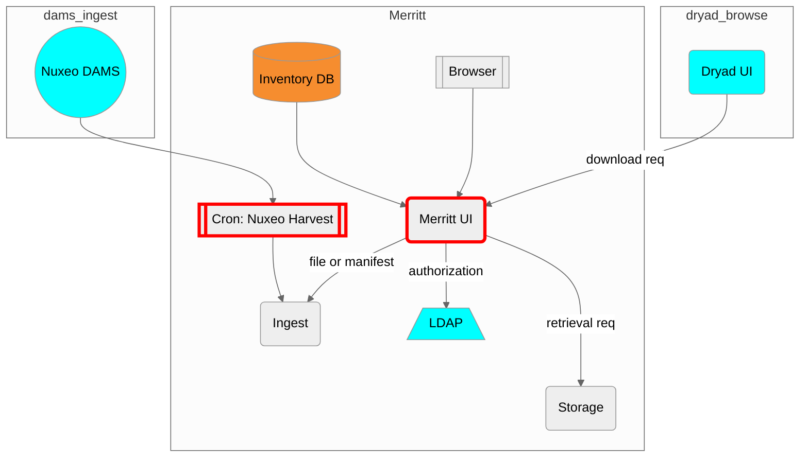

# Merritt Dashboard (Merritt UI)

This microservice is part of the [Merritt Preservation System](https://github.com/CDLUC3/mrt-doc).

## Purpose

This microservice provides the User Interface for the Merritt Perservation System.

This microservice provides API functionality for the [Dryad](https://datadryad.org/)
and for the harvesting of Nuxeo content feeds for ingest into Merrit. 

## Component Diagram

## API Summary
[Swagger Documentation](https://petstore.swagger.io/?url=https://raw.githubusercontent.com/CDLUC3/mrt-dashboard/main/swagger.yml)

## Dependencies

This code depends on the following Merritt Libraries.
- [UC3 SSM Gem](https://github.com/CDLUC3/uc3-ssm)

## For external audiences
This code is not intended to be run apart from the Merritt Preservation System.

See [Merritt Docker](https://github.com/CDLUC3/merritt-docker) for a description of how to build a test instnce of Merritt.

## Build instructions
Ruby bundler is used to build this application.

## Test instructions
GitHub Actions are used to test this application.

RSpec and Capybara tests exist for this application.

## Internal Links
- https://github.com/CDLUC3/mrt-doc-private/blob/main/uc3-mrt-ui.md
